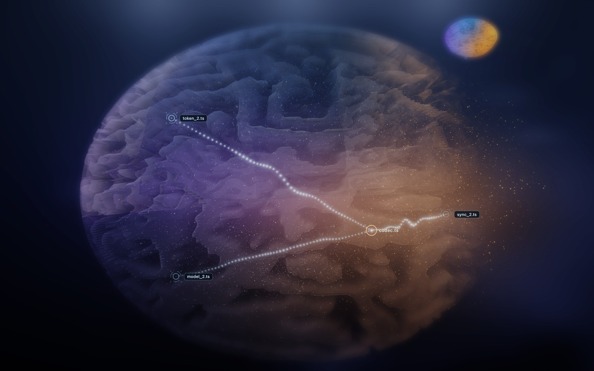

# dwago

Ask your codebase anything.

`dwago build .` parses every file and symbol with tree-sitter, resolves the
imports, groups the files into communities, and mines your git history. Then
you ask questions in plain English and get answers that cite `file:line`.
No API key. Nothing leaves your machine.


That is the map. Files are neurons, the biggest communities are lobes, imports
are the wiring, and the gold spray marks where the code is churning. It is one
HTML file that works offline. I wanted a map you could actually use, and every
code map I had seen was a screenshot for slide decks. So the map and the search
share the same index.

## Why this exists

Parsers can't see time. The file that breaks in prod is usually the one that
changed forty times this quarter, in lockstep with a config file nobody
documented. That link is invisible in the code and obvious in git. dwago mines
it, with a significance test so coincidences don't count, and ranks files by
recent churn and bus factor while it's there.

The second reason is that substring search can't answer "where do we prevent
double charging". Semantic search can. dwago runs BM25 and embeddings
together, fuses the rankings, then lets relevance flow along import and
co-change edges so the neighborhood of a good hit surfaces too.

I don't ask you to take any of this on faith. `dwago eval` replays your own
git history as a benchmark, time-split so the index can't peek at the answers,
with confidence intervals on every comparison. On the two repositories I've
measured, the fused pipeline beat plain BM25 at recall@20 and lost a little
precision at the top on one of them with the small encoder. The tool reports
both. If it loses on your repo, believe your numbers, not this README.

## The strike



Click a file, or pick it from the panel. The rest of the scene dims, strikes
run along its real edges, and every connected file gets a reticle and a name.
The same information as `dwago impact`, drawn instead of printed.


The panel on the left switches views. Neurons strips the shell away and shows
the bare network. Key files rings the hotspots git complains about most.

## What you can ask

| question | command |
|---|---|
| where is X, how does Y work | `dwago ask "how do we prevent double charging?"` |
| give me everything for this task, budgeted, cited | `dwago pack "migrate the session store" --budget 8000` |
| what breaks if I touch this | `dwago impact src/auth/session.ts` |
| what always changes with this file | `dwago co-change src/db/store.ts` |
| where is the risk concentrated | `dwago hotspots` |
| what did the last ten commits touch, really | `diff_impact` over MCP |
| which tests cover this | `tests_for` over MCP |
| how are these two files connected | `path`, `cycles` over MCP |
| show me | `dwago map` |

## Install

```bash
uv tool install "dwago[lexical,fast,mcp] @ git+https://github.com/Dwago20/dwago"
```

From a clone, `pip install -e ".[lexical,fast,mcp]"`. Swap `fast` for `dense`
if you want the full encoder; it needs torch and it is slower and better.

## Use

```bash
dwago build . --fast     # a 2,000-file monorepo takes about a minute
dwago ask "where is the OIDC issuer configured?"
dwago map                # writes dwago-out/brain.html, open it
dwago eval               # benchmark it on your own history first
```

After a commit, `dwago refresh` re-embeds only what changed. Readers never see
a half-built index; a build publishes atomically or not at all.

## Works with your agent, or without one

The MCP server speaks the standard protocol, so Cursor, Claude Code, Codex
CLI, Cline, Windsurf and Zed all get the same 13 tools:

```bash
dwago serve /path/to/repo
```

`SKILL.md` is plain markdown instructions with a command table. Claude Code
users copy it to `~/.claude/skills/dwago/`. Everyone else can paste it into
AGENTS.md or point their rules file at it. There is nothing vendor-specific
in it.

And the CLI needs no agent at all. The one feature that calls a model is
`dwago summarize`, and its backend is whatever you have, `OPENAI_API_KEY`,
`ANTHROPIC_API_KEY`, a local `claude` CLI, or nothing. Skip it and everything
else still works.

## Languages

Python, TypeScript, TSX, JavaScript, Go, Rust, Java, C, C++, C#, Ruby, PHP,
plus Markdown and RST as document nodes. Import edges are resolved exactly for
Python and TypeScript/JavaScript. The other languages still get containment,
communities and the whole git layer. If you already have a node-link
`graph.json` from another tool, `dwago build --graph path.json` ingests it.

## Rough edges

`tests_for` is a coupling heuristic and says so in its own output; coverage
ingestion would make it exact. Co-change is correlation, and the tool reports
lift and p-values so you can judge. The small encoder trades accuracy for
speed, measurably. Above 200k nodes, nearest-neighbor search still needs an
ANN index I haven't wired in. 67 tests cover what's here today.

## License

Apache-2.0.
